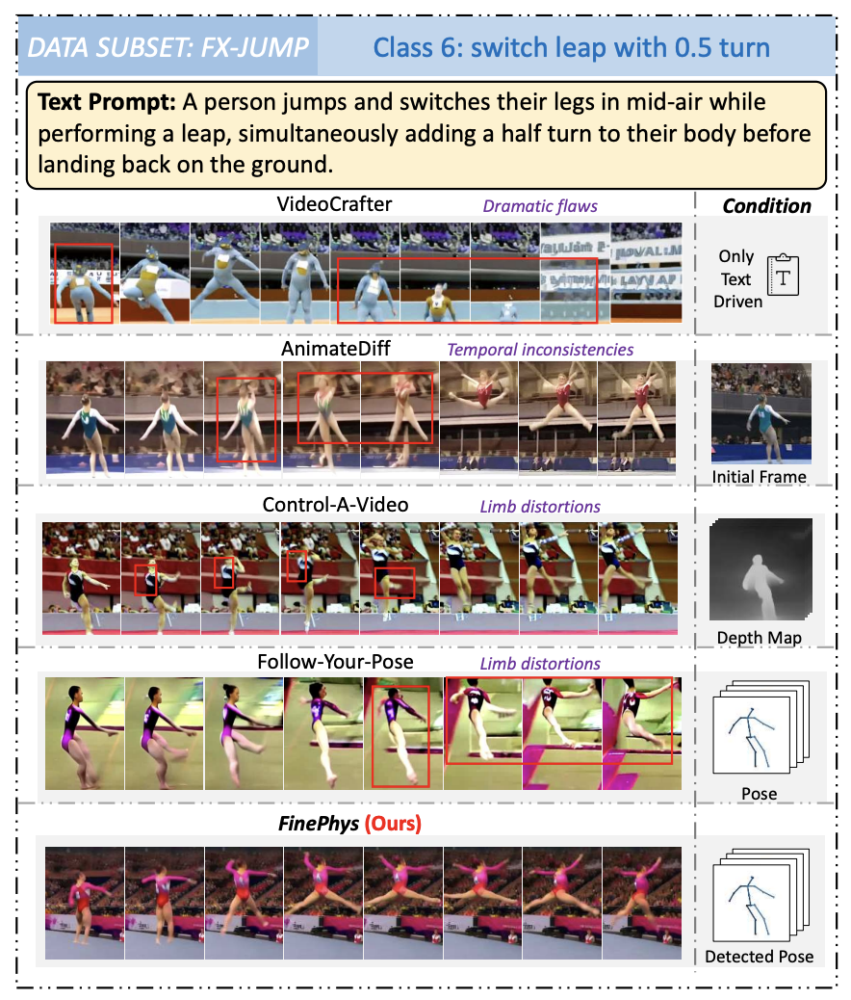

<!-- <p align="center">
    
<p> -->
<h2 align="center"> FinePhys: Fine-grained Human Action Generation by Explicitly Incorporating Physical Laws for Effective Skeletal Guidance</h2>
<!-- {: width="50%"} -->
<!--  -->
<div align="center">
<!-- </img> -->


_**[Dian Shao](https://scholar.google.com/citations?user=amxDSLoAAAAJ&hl=en)<sup>†</sup>, [Mingfei Shi](https://github.com/SmartDianLab/FinePhys), [Shengda Xu](https://github.com/SmartDianLab/FinePhys), [Haodong Chen](https://haroldchen19.github.io/), [Yongle Huang](https://kylehuang9.github.io/), [Binglu Wang](https://github.com/SmartDianLab/FinePhys)**_
<br><br>
<sup>†</sup>Corresponding Author
<br>
Northwestern Polytechnical University

<h5 align="center"> If you like our project, please give us a star ⭐ on GitHub for latest update.  </h2>

 <a href='https://arxiv.org/abs/2504.13122'></a> &nbsp;
 <a href='https://smartdianlab.github.io/projects-FinePhys/'></a> &nbsp;
<br>
<strong>IEEE/CVF Computer Vision and Pattern Recognition (CVPR) 2025</strong>
</div>

## Abstract
Although remarkable progress has been achieved in video generation, synthesizing physically plausible human actions remains an unresolved challenge, especially when addressing fine-grained semantics and complex temporal dynamics. For instance, generating gymnastics routines such as “two turns on one leg with the free leg optionally below horizontal” poses substantial difficulties for current video generation methods, which often fail to produce satisfactory results. To address this, we propose FinePhys, a Fine-grained human action generation framework incorporating Physics for effective skeletal guidance. Specifically, FinePhys first performs online 2D pose estimation and then accomplishes dimension lifting through in-context learning. Recognizing that such data-driven 3D pose estimations may lack stability and interpretability, we incorporate a physics-based module that re-estimates motion dynamics using Euler-Lagrange equations, calculating joint accelerations bidirectionally across the temporal dimension. The physically predicted 3D poses are then fused with data-driven poses to provide multi-scale 2D heatmap-based guidance for the video generation process. Evaluated on three fine-grained action subsets from FineGym (FX-JUMP, FX-TURN, and FX-SALTO), FinePhys significantly outperforms competitive baselines. Comprehensive qualitative results further demonstrate FinePhys's ability to generate more natural and plausible fine-grained human actions.

<table class="center">
    <tr>
    <td></td>
    </tr>
</table>
 
## 🔥 Update
- __[2025.05.07]__: Initialized this github repository and README.


## 🧰 TODO

- [ ] Release Paper.
- [ ] Release training code
- [ ] Release inference code.
- [ ] Release model weights.

<!-- ## 🧰 Models

|Model|Resolution|GPU Mem. & Inference Time (A100, ddim 50steps)|Checkpoint|
|:---------|:---------|:--------|:--------|
|DynamiCrafter1024|576x1024|18.3GB & 75s (`perframe_ae=True`)|[Hugging Face](https://huggingface.co/Doubiiu/DynamiCrafter_1024/blob/main/model.ckpt)|

Currently, our DynamiCrafter can support generating videos of up to 16 frames with a resolution of 576x1024. The inference time can be reduced by using fewer DDIM steps.

GPU memory consumed on RTX 4090 reported by @noguchis in [Twitter](https://x.com/noguchis/status/1754488826016432341?s=20): 18.3GB (576x1024), 12.8GB (320x512), 11.9GB (256x256). -->


## 📖 Contents

Coming Soon~


## 📝 Citation
Please consider citing our paper if our code and benchmark are useful:
```bib
TBD...
```


## 📪 Contact

For any question, feel free to email ```mingfeishi5@mail.nwpu.edu.cn```.
